# RouteFlow — Complete Project Architecture & Visual Guide

> **Warehouse-to-Retailer Logistics & Field Distribution System for Indian FMCG / Kirana Distributors**

---

## 1. Executive Summary & Core Value

**RouteFlow** connects the entire daily distribution lifecycle into one real-time system:
$$\text{Owner Setup} \longrightarrow \text{Sales Beat \& GPS Visit} \longrightarrow \text{Order Booking} \longrightarrow \text{Owner Approval} \longrightarrow \text{Godown Picking} \longrightarrow \text{Driver OTP Delivery} \longrightarrow \text{Cash Handover Settlement}$$

Unlike heavy corporate enterprise software (Bizom, FieldAssist) or single-shop billing apps (Vyapar, Khatabook), RouteFlow gives the distributor complete visibility across **Web Dashboard** and **Android Mobile App**, synced to a unified **Cloudflare Workers + D1 database backend**.

---

## 2. Technology Stack

- **Android App:** Kotlin, Jetpack Compose, Material 3, Room Database (Offline-first cache), Hilt DI, Retrofit/OkHttp, WorkManager.
- **Web Dashboard:** Next.js 16 (App Router), React 19, TypeScript, Tailwind CSS, deployed on Vercel (`https://appdashboardadmin.vercel.app`).
- **Backend API:** Cloudflare Workers running Hono framework (`https://routeflow-api-staging.thisisrakesh21.workers.dev`).
- **Database:** Cloudflare D1 (Serverless SQLite with atomic ledger constraints).
- **Localization:** Real-time 1-tap English and Hindi (`हिन्दी`) language engine.

---

## 3. UI Design System & Brand Palette

| Token Name | Hex Code | Purpose / Where It Appears |
|---|---|---|
| **Primary Brand Blue** | `#2563EB` | Primary buttons (`Sign In`, `Submit Order`, `Proceed to Deliver`), active navigation icons, headers |
| **Accent / Selected Tint** | `#EFF6FF` | Navigation pill highlight, active chip background |
| **Success / Approved Green** | `#10B981` / `#059669` | `Synced` badges, `DELIVERED` status, `ACCEPTED` cash handover |
| **Warning / Pending Amber** | `#F59E0B` / `#D97706` | `Pending Approvals`, `OUT_FOR_DELIVERY` status, low stock alerts |
| **Error / Exception Red** | `#EF4444` / `#DC2626` | Logout action, delivery failed alerts, negative stock guards |
| **Background Neutral** | `#F8FAFC` | App screen background |
| **Card Surface** | `#FFFFFF` | Elevated cards, input fields, modals |
| **Text Primary** | `#0F172A` / `#1E293B` | Titles, store names, currency amounts |
| **Text Secondary / Muted** | `#64748B` / `#94A3B8` | SKUs, addresses, timestamps, secondary labels |

---

## 4. Visual Walkthrough & Screenshots Tour (30 Total Screenshots)

### Section A: Web Operations Console (Office & Owner Management)

| 13. Web Login Portal | 14. Web Owner Dashboard Overview |
|:---:|:---:|
|  |  |
| *Role Quick-Fills for Owner, Admin, Sales, Godown, Driver* | *Delivered sales, live Godown stock & outstanding credit* |

| 15. Web Orders Management & Approval | 16. Web Godown Inventory & Stock Levels |
|:---:|:---:|
|  |  |
| *Status filters (Pending, Approved, Dispatched, Delivered)* | *SKU stock counts, wholesale pricing & instant updates* |

| 17. Web Retailer Directory | 18. Web Cash Handovers Ledger |
|:---:|:---:|
|  |  |
| *Registered kirana stores, credit limits & beat mapping* | *Driver collection audit and 1-click cash reconciliation* |

| 19. Web Add Retailer Modal (GPS & Beat) | 20. Web Add Product Modal (Godown SKU) |
|:---:|:---:|
|  |  |
| *Auto GPS detection, credit limit and phone verification* | *Item creation with wholesale unit pricing and opening stock* |

---

### Section B: Mobile App — Authentication & Executive Overview

| 01. Mobile Login Screen (English) | 02. Mobile Login Screen (Hindi - हिन्दी) |
|:---:|:---:|
|  |  |
| *Role selectors: Owner, Admin, Sales, Warehouse, Delivery* | *Localized Hindi login screen without text clipping* |

| 03. Owner Dashboard (English) | 04. Owner Dashboard (Hindi - हिन्दी) |
|:---:|:---:|
|  |  |
| *Executive KPI cards: Approvals, Stock, Delivered Sales* | *Hindi localized metrics for Indian business owners* |

| 27. Owner Orders & Approvals Hub | 28. Owner Master Business Godown Hub |
|:---:|:---:|
|  |  |
| *Atomic order approvals & physical stock reservation* | *Godown catalog, product pricing & category breakdown* |

| 29. Owner Team Management & Roster | 30. Owner Field Operations Activity |
|:---:|:---:|
|  |  |
| *Staff directory, assigned beats, phone & role permissions* | *Live field check-ins, sales visits, and GPS audit log* |

---

### Section C: Mobile App — Field Sales Operations

| 05. Sales Today Beat (`BEAT-04`) | 06. Beat Retailer Directory |
|:---:|:---:|
|  |  |
| *Assigned Beat, visit progress, order totals, target tracker* | *Active shops on route with outstanding balances & Check-In* |

| 07. Add Shop with Phone GPS | 08. Product Catalog & Order Booking |
|:---:|:---:|
|  |  |
| *1-Tap GPS coordinate capture for new Kirana onboarding* | *Warehouse stock badges, schemes (Buy 10 Get 1 Free), instant cart* |

| 21. Sales Collections & Ledger | 22. Sales Profile & Shift Attendance |
|:---:|:---:|
|  |  |
| *Store payment records, receipt ledger & cash collections* | *Attendance shift tracker, language toggle & security* |

| 23. Sales Offline Sync & Logout |
|:---:|
|  |
| *Room DB local cache sync with Cloudflare server & secure logout* |

---

### Section D: Mobile App — Warehouse & Godown Operations (Distributor Fulfillment)

| 01. Godown Desk (Home) | 02. Godown Stock Inventory |
|:---:|:---:|
| 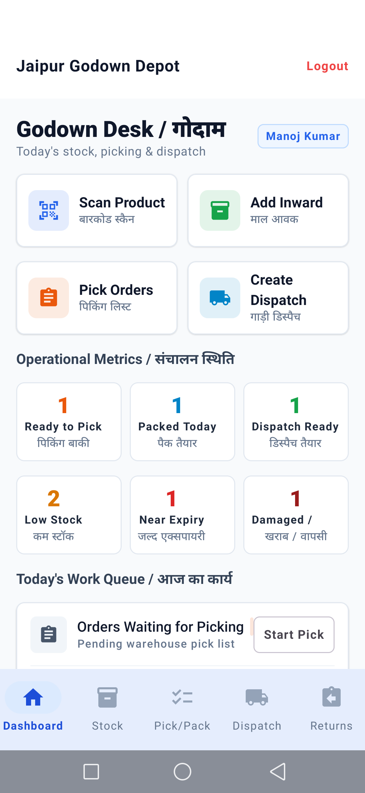 | 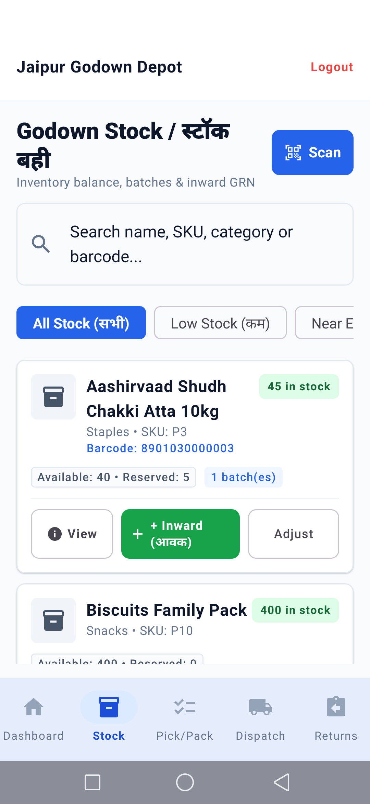 |
| *Single depot header, quick actions, 6 KPI cards, Today's Work* | *Stock search, 1-tap Scan SKU, inventory badges & batch count* |

| 03. Product Detail Sheet | 04. Camera Barcode / QR Scanner |
|:---:|:---:|
| 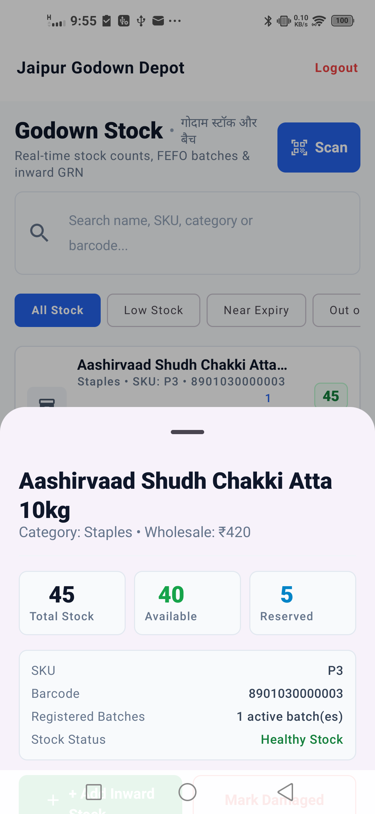 | 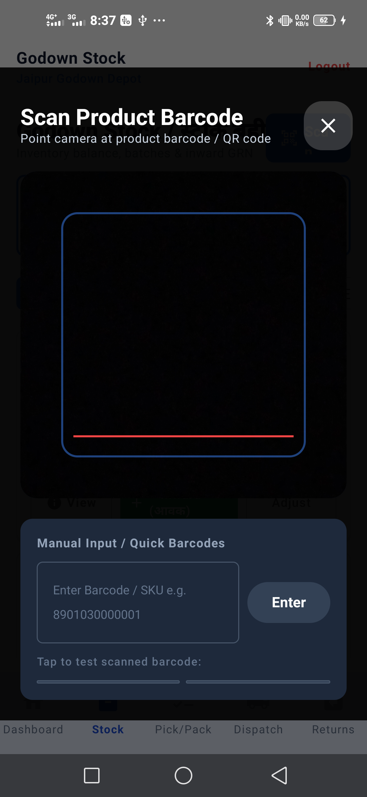 |
| *Total, Available & Reserved breakdown with system nav padding* | *CameraX laser viewfinder, manual entry & quick test chips* |

| 05. Picking Queue (Empty State) | 06. Picking & Carton Packing |
|:---:|:---:|
| 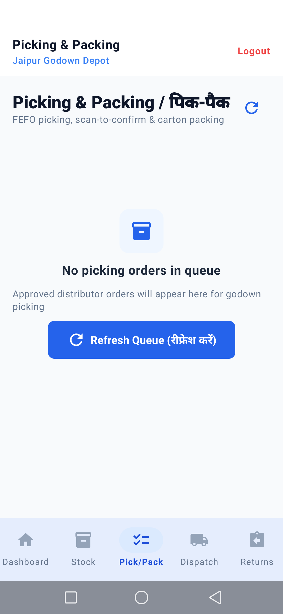 | 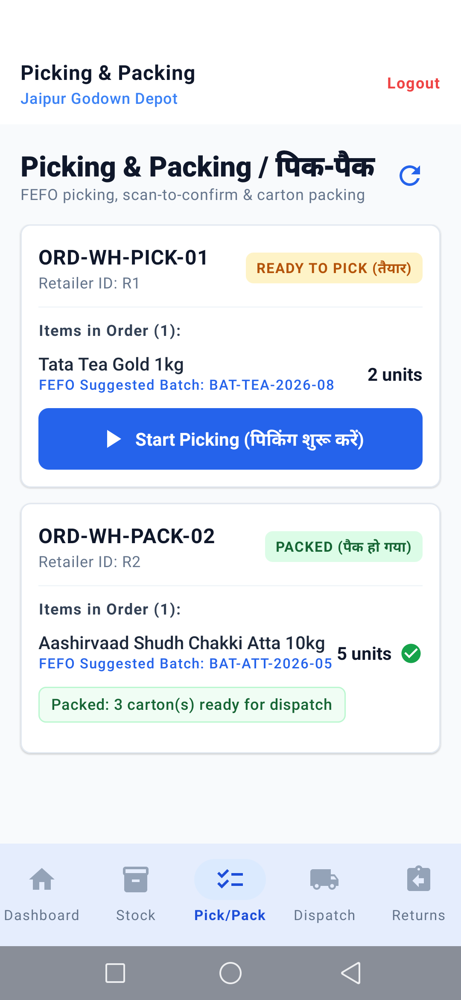 |
| *Zero-order queue with Refresh CTA and clear guidance* | *FEFO batch guidance, carton packaging & item verification* |

| 07. Dispatch Batch & Handover | 08. Returns & Damaged Desk |
|:---:|:---:|
| 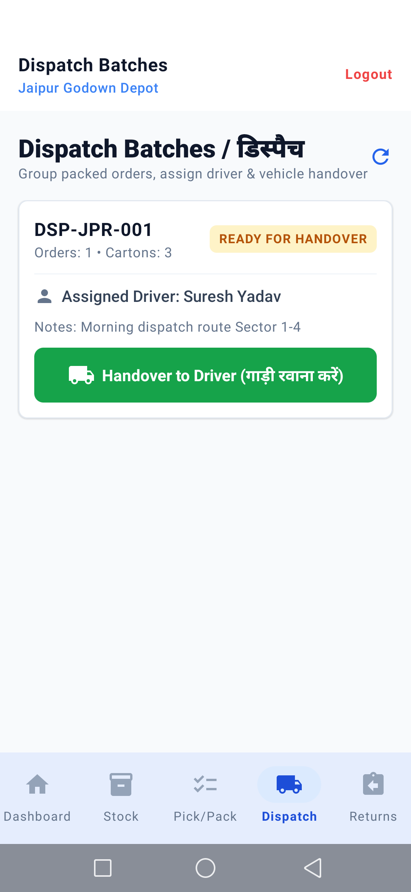 | 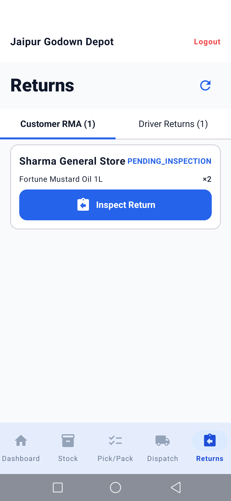 |
| *Driver dispatch batches with Handover to Driver action* | *Retailer RMA requests and Driver undelivered returns desk* |

| 09. Driver Return Inspection | 10. Customer RMA Disposition |
|:---:|:---:|
| 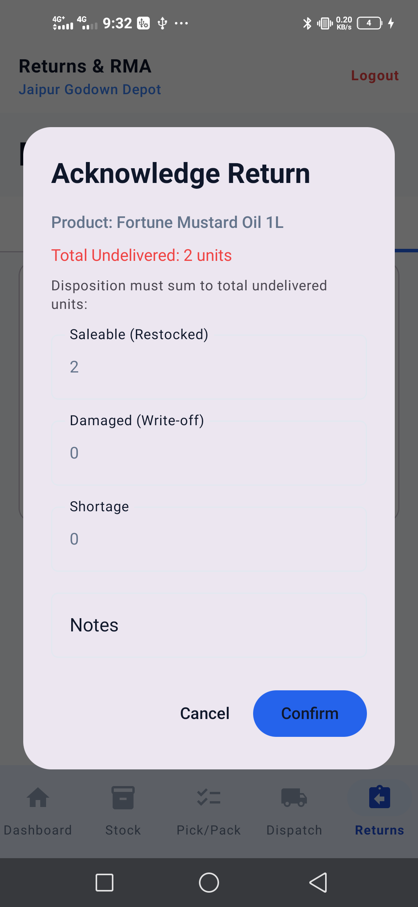 | 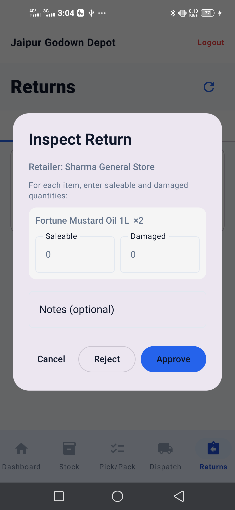 |
| *Reconcile driver stock: Saleable, Damaged, Shortage* | *Kirana store return inspection: Approve or Reject* |

---

### Section E: Mobile App — Delivery Verification & Cash Handover

| 10. Delivery Route & Assigned Orders | 11. Server 6-Digit OTP Delivery Proof |
|:---:|:---:|
|  |  |
| *Driver dispatch list with amount due & shop address* | *Server-validated 6-digit OTP delivery confirmation* |

| 12. Cash Custody & Owner Settlement | 26. Delivery Day Overview & Trip Summary |
|:---:|:---:|
|  |  |
| *Driver physical COD cash handover & owner reconciliation to ₹0.00* | *Assigned route trip progress & stops remaining* |

---

## 5. Role & Permission Matrix

| Role | Primary Device | Navigation Tabs | Permissions & Purpose |
|---|---|---|---|
| **Owner** | Web + Phone | Home, Orders, Business, Team, Activity | Master control, order approvals, cash settlement, employee management |
| **Admin / TL** | Web + Phone | Home, Orders, Team, Activity | Operations manager, delivery assignment, route exceptions |
| **Sales Executive** | Phone (Field) | Today, Shops, Booking, Collections, Profile | Store onboarding with GPS, shop visits, order booking, payment receipts |
| **Warehouse Manager** | Phone (Godown) | Dashboard, Stock, Pick/Pack, Dispatch, Returns | Camera barcode scan, FEFO picking, carton packing, dispatch handover, RMA inspections |
| **Delivery Executive** | Phone (Van/Bike)| Trips, Deliveries, Handover, Profile | Route navigation, OTP delivery proof, cash custody, owner handover |

---

## 6. Production Governance & Architecture Extensions

1. **Company Onboarding Wizard (`/onboarding/wizard-setup`)**: One-shot transaction for multi-godown setup, staff credentials, route beats, initial product catalog, and legacy retailer ledger balances.
2. **Granular Permissions (`/permissions`)**: Owner-controlled dynamic policy matrix for order approvals, stock adjustments, discount bounds, and cash reversals.
3. **Forensic Audit Trail (`/audit-logs`)**: Device ID, IP address, user ID, role, and exact timestamp recorded across all stock, payment, delivery, and dispatch transactions.
4. **Data Portability & Export (`/export/:entity` & `/export/backup-json`)**: RFC 4180 CSV export for inventory, clients, orders, payments, plus full JSON state dump.
5. **Payment Verification Lifecycle (`/payments/verification-queue`)**: Enforces `ENTERED` -> `VERIFIED` -> `CLEARED` flow before driver balance settlement.
6. **Play Store Compliance & Data Safety**: Full compliance document at [PLAY_STORE_DATA_SAFETY.md](file:///d:/app/PLAY_STORE_DATA_SAFETY.md), privacy policy at [PRIVACY_POLICY.md](file:///d:/app/PRIVACY_POLICY.md) and live web route `/privacy`.

---

## 7. Daily Operating System: 10 Core Business Modules

RouteFlow integrates 10 daily operational modules purpose-built for FMCG & kirana distributors managing daily sales & warehouse dispatch:

1. **Owner Control Room (`/control-room/pulse`)**:
   - Live command center showing today's booked sales, settled cash, pending approvals, driver cash handovers, failed deliveries, critical low stock, active salesmen/drivers on shift, top overdue retailers, and tomorrow's purchase suggestions.
2. **Daily Opening & Night Closing Day Book (`/day-book/today` & `/day-book/checklist`)**:
   - **Morning Opening Checklist**: Verification of pending orders, packed dispatches, low stock, staff attendance, and delivery route readiness.
   - **Night Closing Snapshot**: Aggregated daily sales totals, collections by mode (Cash, UPI, Cheque), cash handover settlement, undelivered returns, and next-day tasks.
3. **Central Exception Center (`/exceptions/feed`)**:
   - Aggregates operational friction points in real-time: failed deliveries, unverified UPI/Cheque entries, pending driver cash handovers, out-of-stock SKUs, near-expiry product batches, and retailers exceeding 80% credit limit.
4. **Retailer 360 Profile (`/retailers/:id/360`)**:
   - Comprehensive customer dossier: GPS coordinates, credit limits, ledger balance, order history, last ordered items with 1-click repeat reorder, visit history notes, and dynamic WhatsApp statement share links (`wa.me`).
5. **Godown Control & Movement Ledger (`/godown/movement-ledger`)**:
   - Live movement tracking across inward supplier GRNs, physical stock audit adjustments, and damaged/returned items.
6. **Delivery Control & Dispatch Sequencing (`/trips`)**:
   - Delivery route sequencing, assigned vehicles, live order delivery statuses, partial deliveries, failure reason categorization, and driver-held return custody.
7. **Cash Control & Daily Cash Book (`/cash-control/daily-book` & `/cash-control/expenses`)**:
   - Tracks cash inflow vs business expenses (fuel, loading/unloading, vehicle repair, petty cash) with net cash in hand calculations and owner reconciliation.
8. **Purchase Planning Engine (`/purchase-planning/suggestions`)**:
   - Detects fast-moving products and low inventory, generating suggested purchase order unit quantities and estimated procurement costs.
9. **Staff Control & Attendance (`/staff-control/summary`)**:
   - Shift start/end times, real-time on-shift status, shop visits logged, and field activity summaries.
10. **Reports & Printable Slips (`/reports/printable/:docType`)**:
    - Browser print-ready and PDF-styled documents for Daily Business Closing Slips, Retailer Account Statements, and Tax Invoices.

---

---

---

## 8. Warehouse & Godown Operations Module (Blinkit-Style FMCG Fulfillment)

RouteFlow equips warehouse managers and godown munshis with a high-density, real-time fulfillment console designed for rapid physical operations:

### 8.1 Core Operational Pillars

1. **Scan Product (बारकोड स्कैन)**:
   - Built on Android CameraX with high-frame-rate continuous autofocus and laser viewfinder overlay.
   - 1-tap instant SKU lookup by barcode (`EAN-13`, `Code-128`, `QR`).
   - Graceful fallback: If camera permission is denied or physical lens is obstructed, manual SKU entry and quick test chips are immediately available with zero crash risk.

2. **Stock & Batch Management (स्टॉक और बैच)**:
   - Real-time tripartite stock ledger: **Total Physical Stock**, **Available Stock**, and **Reserved Stock** (held for approved pending orders).
   - Multi-batch tracking with Batch Number, Manufacturing Date (MFG), Expiry Date (EXP), and Days-to-Expiry badges.
   - Quick Inward Stock receipt (आवक माल) and Physical Stock Audit adjustment with positive/negative discrepancy notes.

3. **Order Picking (माल निकालना)**:
   - Approved sales orders automatically populate the warehouse picking queue.
   - **FEFO Engine (First-Expiry-First-Out)**: Automatically recommends the oldest non-expired batch to pick, minimizing godown obsolescence.
   - Item-by-item pick checklist with barcode validation preventing wrong item fulfillment.

4. **Carton & Crate Packing (पैक करें)**:
   - Consolidates picked goods into durable cartons and crates.
   - Records carton count, gross weight, and packaging notes.
   - Generates carton manifest labels ready for vehicle loading.

5. **Dispatch Batch & Handover (गाड़ी रवानगी)**:
   - Groups packed orders by delivery route/beat into a single Dispatch Batch (`DSP-XXXX`).
   - Assigns vehicle and delivery executive (Driver).
   - 1-tap `Handover to Driver (गाड़ी रवाना करें)` updates orders to `DISPATCHED` and transfers stock custody to the driver.

6. **Returns & Damaged Stock Inspection (वापसी और नुकसान जांच)**:
   - **Driver Undelivered Returns**: Inspect returned items upon driver evening return; categorize into **Saleable (Restock to Available)**, **Damaged (Move to Quarantine)**, or **Shortage (Driver Liability Audit)**.
   - **Customer RMA Returns**: Review shop return requests with defect notes and photo proofs; 1-tap Approve (Credit Note) or Reject.

---

## 9. Owner & Admin Control Room (Wholesale Governance & Fraud Prevention)

For the distributor and business owner (the paying enterprise client), RouteFlow provides a commanding yet straightforward management experience:

### 9.1 Core Governance Capabilities

1. **Control Room Dashboard (Owner Home)**:
   - **8 Real-Time KPI Cards**: Today Sales, Cash Collected, Pending Udhaar, Pending Approvals, Low Stock Items, Failed Deliveries, Pending Cash Handovers, and Staff On Duty.
   - **5 Quick Action Shortcuts**: Approve Orders, View Cash & Handovers, Staff Location Monitor, Stock Alert, and Reports.
   - Clean, professional styling with zero demo tags ("Step 1/8 • Demo" removed completely).

2. **Order Approvals & Risk Engine**:
   - Order review displaying Retailer Name, Order Amount, Credit Limit, and Current Outstanding Udhaar balance.
   - **Financial Badges**: Dynamic `Credit OK` vs `Credit Exceeded` calculated directly against credit headroom.
   - **Stock Availability Badges**: `Stock Ready` vs `Low Stock / Partial` preventing impossible dispatches.
   - **Structured Rejection Dialog**: Preset operational rejection reasons (Credit Limit Exceeded, Stock Shortage, Route Closed, Payment Overdue).

3. **Employee Management & Security Governance**:
   - Comprehensive staff roster with active/deactivated badge indicators.
   - **Role-Gated Password Reset**: Exclusively Owner/Admin can reset staff passwords via secure modal; instantly revokes all active auth sessions on the server (`is_revoked = 1`) to terminate compromised device access immediately.
   - Beat assignment during onboarding and on-demand staff deactivation.

4. **Retailer Network & Udhaar Khata**:
   - Kirana directory displaying Credit Limits and Outstanding Balances.
   - 1-tap **Direct Call** (`tel:`) and **WhatsApp** (`https://wa.me/`) intent buttons.
   - **Khata Ledger Dialog**: Shows total credit limit, current outstanding Udhaar, available credit headroom, and recent ledger entries.
   - Shelf stock audit view for retail compliance monitoring.

5. **Cash Reconciliation & Physical Handover**:
   - Settlement screen for delivery cash custody and sales collections.
   - Tracks cash discrepancies between physical notes handed over and system-calculated totals with dispute notes.
   - History archive for auditing past accepted handovers.

6. **4-Tab Operations & Daily Summary Reports**:
   - **Field Visits**: Log of check-ins, duration, geo-discrepancy warning badges.
   - **Sales**: Live stream of orders placed today with real-time status (`SUBMITTED`, `OUT_FOR_DELIVERY`, `DELIVERED`).
   - **Collections**: Payment breakup by cash, UPI, and cheque.
   - **Godown Stock**: Itemized stock levels and minimum threshold warnings.
   - **Share Daily Summary**: 1-tap Android share intent to send formatted daily WhatsApp summaries to stakeholders.

7. **Team Live Monitor**:
   - Live field status of sales executives and delivery drivers.
   - Stop progress indicator (`X / Y completed`), shift start timestamp, last reported GPS coordinates, and stale location alerts (>15m).

### 9.2 Owner Screenshots Tour

| 01. Owner Control Room | 02. Order Approvals Engine |
|:---:|:---:|
| 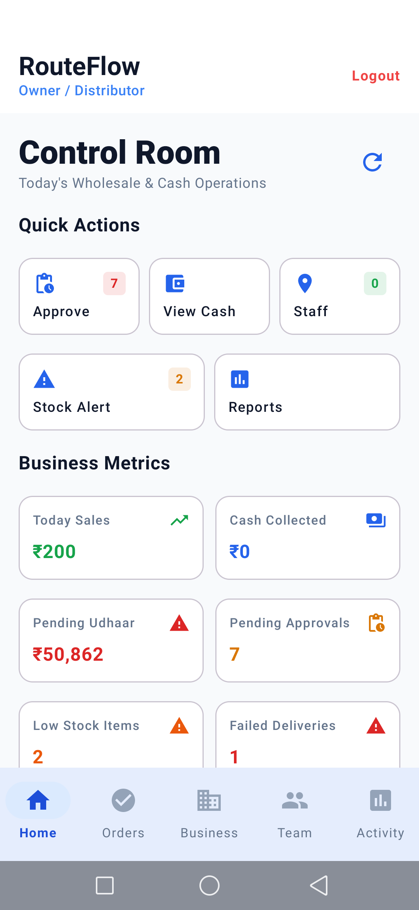 | 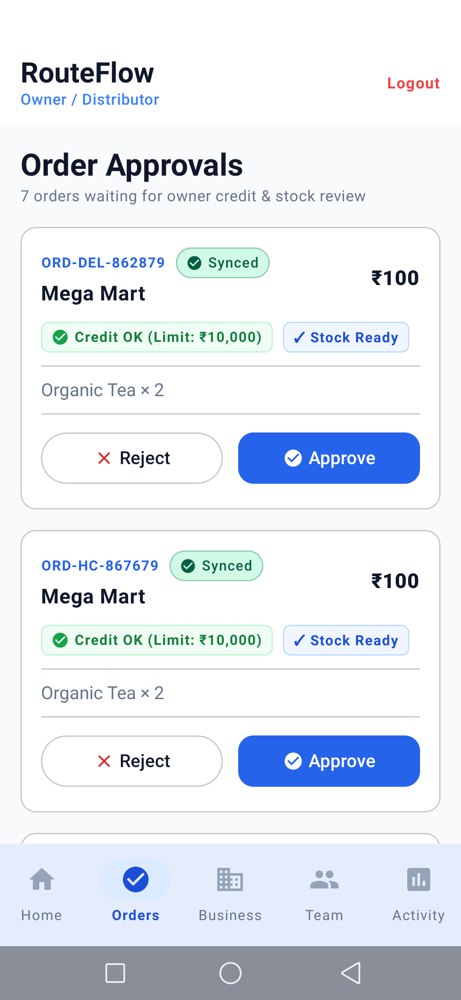 |
| *8 Live KPIs, 5 Quick Actions, Zero demo badges* | *Credit Limit vs Udhaar validation & Stock badges* |

| 03. Staff Roles & Password Reset | 04. Retailer Network & Khata |
|:---:|:---:|
| 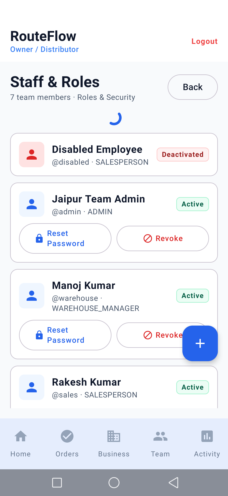 | 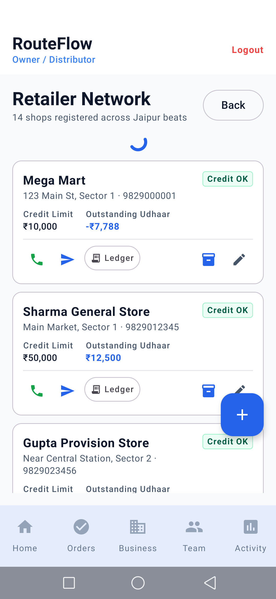 |
| *Active/Deactivated badges, Owner-only password reset* | *Credit headroom, 1-tap WhatsApp/Call, Ledger dialog* |

| 05. Cash Handover Reconciliation | 06. Reports & Operations (Sales) |
|:---:|:---:|
| 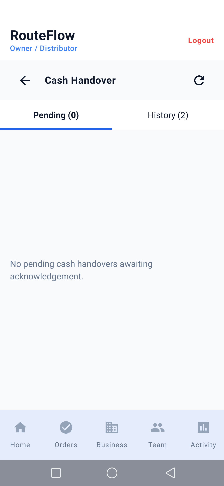 | 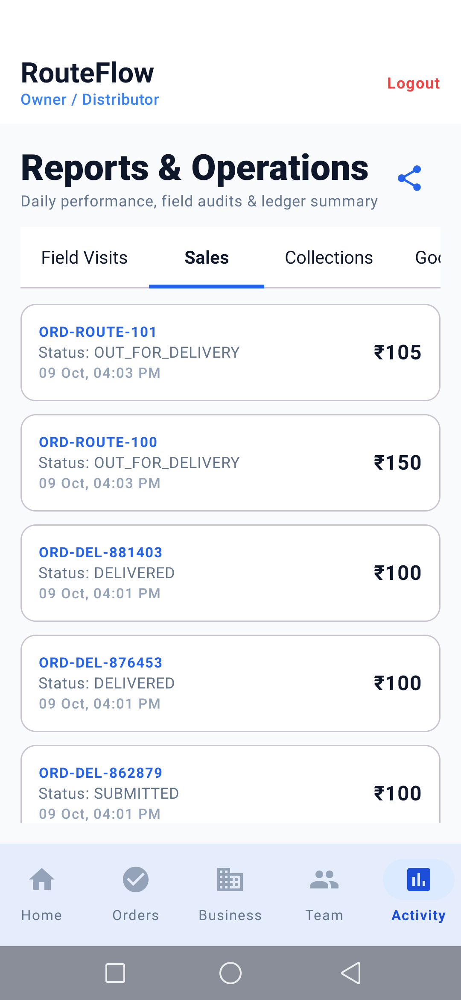 |
| *Pending handovers, physical discrepancy tracking* | *4-Tab report: Visits, Sales, Collections, Stock* |

| 07. Team Live Monitor | 08. Godown Product Catalog |
|:---:|:---:|
| 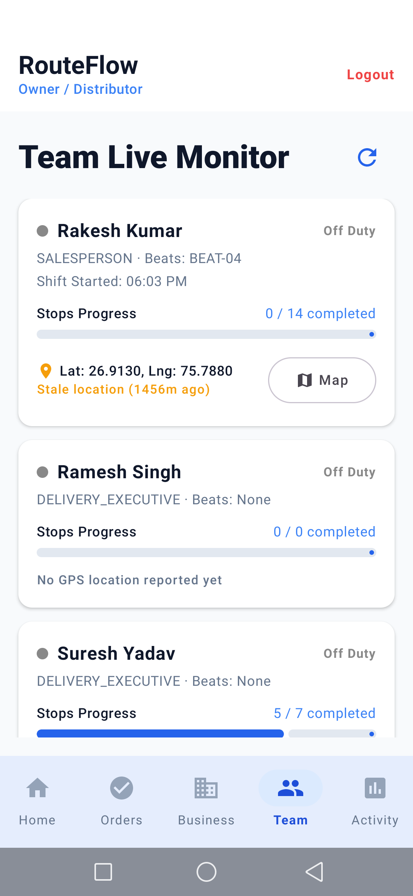 | 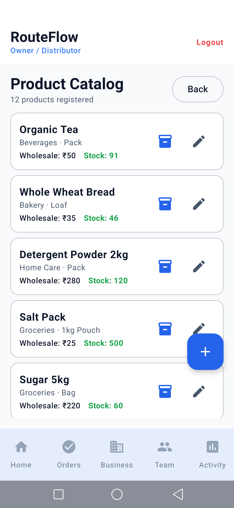 |
| *GPS tracking, shift status, stop completion progress* | *Live stock inventory, wholesale pricing, add SKU* |

---

## 10. 60-Second Client Demo Script

Use this exact field-tested script during investor or distributor client demonstrations:

> **"Warehouse manager scans product, adds inward stock, picks order using FEFO batch, packs carton, creates dispatch batch, hands over to delivery person, and inspects returns."**

### Step-by-Step Demo Flow:

| Step | Action on Device | What to Show / Say |
|---|---|---|
| **1. Godown Desk** | Tap **Warehouse** role &rarr; view **Godown Desk**. | *"Notice the single clean depot header 'Jaipur Godown Depot', 6 live operational counters, and today's work queue."* |
| **2. Scan & Stock** | Tap **Scan Product** &rarr; scan barcode or enter `8901030000001`. | *"Camera opens instantly with laser guide. Barcode lookup retrieves Tata Tea Gold with available vs reserved stock and FEFO batches."* |
| **3. Inward Stock** | Tap **Add Stock** on product card &rarr; enter +25 units, batch `BATCH-2026-OCT`. | *"Stock is updated immediately with atomic Cloudflare D1 ledger entries; low stock warning disappears in real-time."* |
| **4. Pick Order (FEFO)** | Tap **Pick/Pack** tab &rarr; view `ORD-WH-PICK-01` &rarr; tap **Start Picking**. | *"The system explicitly highlights the FEFO batch (Batch B-202) expiring first, ensuring the godown never ships stale inventory."* |
| **5. Pack into Cartons** | Tap **Mark Packed** &rarr; enter 3 Cartons &rarr; submit. | *"Order status shifts to PACKED with carton count recorded for driver vehicle loading."* |
| **6. Dispatch Handover** | Tap **Dispatch** tab &rarr; find `DSP-JPR-001` &rarr; tap **Handover to Driver**. | *"Custody transfers atomically to Delivery Executive Suresh Yadav; orders flip to Dispatched and driver app receives delivery route."* |
| **7. Returns Inspection** | Tap **Returns** tab &rarr; open Driver Return &rarr; allocate Saleable vs Damaged. | *"Returned units are inspected: good items return to available inventory, while damaged items route to quarantine without accounting leaks."* |

---

## 11. Production Readiness Matrix

| Milestone | Status | Key Deliverables & Validation |
|---|:---:|---|
| **Client Demo** | 🟢 **100% READY** | Dual-platform Web + Android APK verified on physical Vivo phone, English/Hindi localization, complete 7-step business flow. |
| **Paid Pilot** | 🟢 **READY** | Hardcore tested empty business setup, Owner Control Room, Daily Day Book closing, isolated D1 database, multi-role auth, CSV export, audit logs, inward GRN. |
| **Play Store Launch** | 🟡 **COMPLIANCE READY** | Public Privacy Policy live at `/privacy`, Data Safety documentation complete, quick-fill login disabled in release builds. Needs signed Keystore `.jks`. |
| **Enterprise Production**| 🟢 **READY** | Cloudflare Workers & D1 serverless scale, atomic stock reservations, fraud-prevention payment queues, full CSV/JSON backup. |

---

## 11. How to Run & Deploy

```bash
# Backend (Cloudflare Workers)
cd backend
npm test                                                                # Run 30 integration tests
node --dns-result-order=ipv4first test/test-hardcore-empty-business.mjs # 16-step hardcore test
npx wrangler deploy --config wrangler.staging.toml                      # Deploy API

# Web Dashboard (Next.js)
cd web
npm run build                                                           # Verify build
# Deployed to Vercel: https://appdashboardadmin.vercel.app

# Android App (Gradle)
.\gradlew.bat testStagingUnitTest --no-daemon                           # Run unit tests
.\gradlew.bat assembleStaging --no-daemon                               # Build Staging APK
adb install -r app\build\outputs\apk\staging\app-staging.apk             # Install on device
```

