# RouteFlow — Warehouse-to-Retailer Logistics & Field Distribution System

> **Designed for Indian FMCG & Kirana Distributors (Jaipur Operations Demo)**  
> **Unified Dual-Platform:** Native Android App (Field Operations) + Next.js Web Dashboard (Office Control)  
> **Live Web Dashboard:** [https://appdashboardadmin.vercel.app](https://appdashboardadmin.vercel.app)  
> **Backend API:** Cloudflare Workers + D1 Serverless SQL

---

## 📱 Complete Visual Tour (Physical Device Screenshots)

All screenshots captured directly from an actual **Vivo 1935** Android device running the RouteFlow Staging build:

### 1. Authentication & Native Hindi Localization
Instant 1-tap demo credential selectors for all 5 roles and seamless real-time English $\leftrightarrow$ Hindi (`हिन्दी`) language switching.

| Login Screen (English) | Login Screen (Hindi - हिन्दी) |
|:---:|:---:|
| 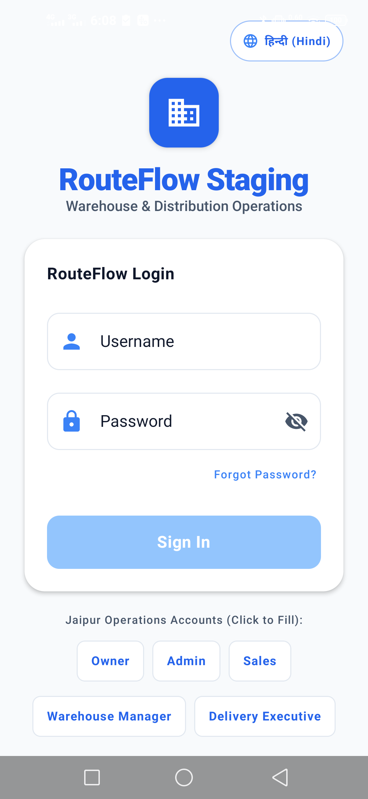 | 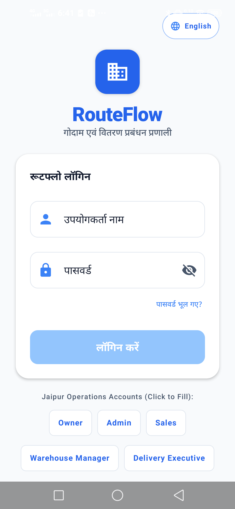 |
| *Role Quick-Fills: Owner, Admin, Sales, Warehouse, Delivery* | *Complete localized interface without text clipping* |

---

### 2. Owner & Executive Control
Real-time distributor business KPIs, order approvals, inventory alerts, and financial reconciliations.

| Owner Dashboard (English) | Owner Dashboard (Hindi - हिन्दी) |
|:---:|:---:|
| 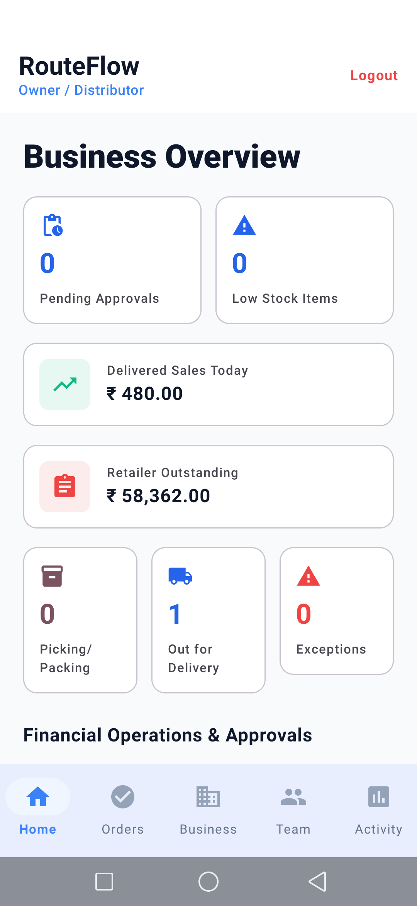 |  |
| *Business KPIs: Approvals, Stock, Delivered Sales, Outstanding* | *Vernacular interface tailored for Indian wholesale distributors* |

---

### 3. Field Sales Operations (Beat, Stores & GPS)
Sales executives manage their assigned daily beat, onboard new Kirana stores with phone GPS, and book orders.

| Sales Today Beat | Active Beat Shops List |
|:---:|:---:|
| 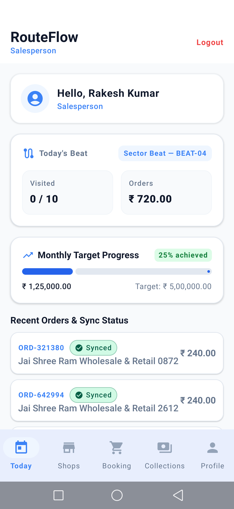 | 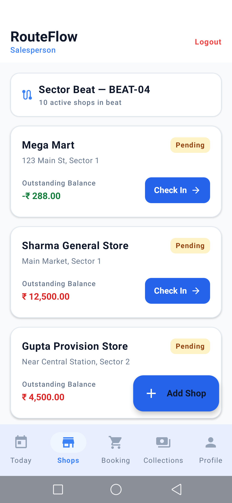 |
| *Assigned Beat, store visits counter, monthly sales target progress* | *Kirana stores on route with live balances & Check-In* |

| Add Shop with Phone GPS | Product Catalog & Order Booking |
|:---:|:---:|
| 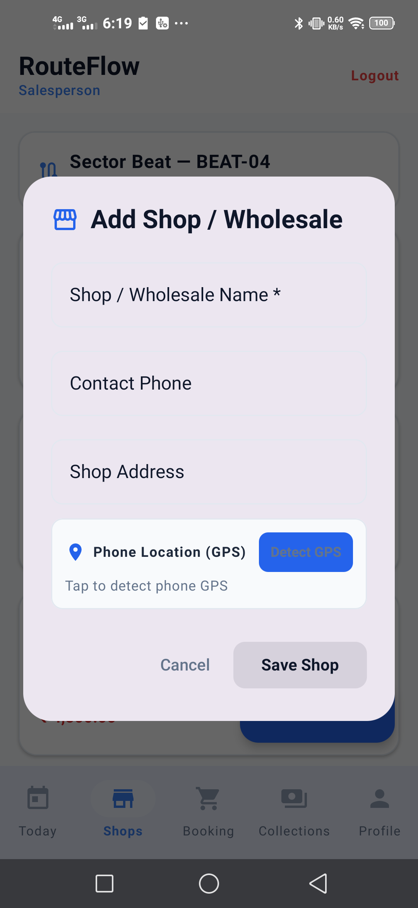 | 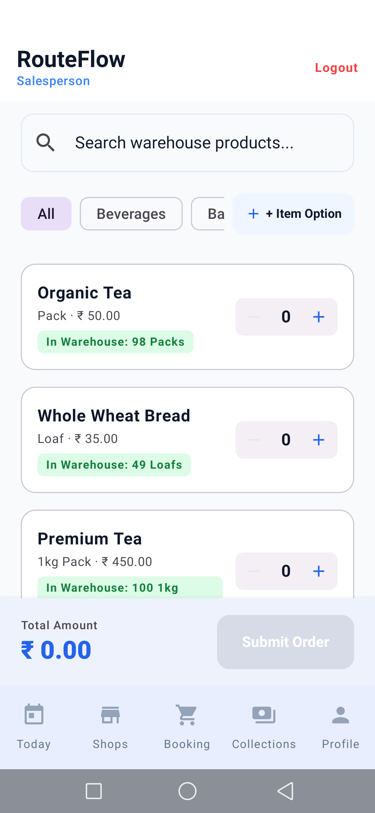 |
| *1-Tap GPS detection locks exact shop location* | *Warehouse stock badges, schemes (Buy 10 Get 1 Free), cart* |

---

### 4. Warehouse Picking, Driver Delivery & Cash Reconciliation
Godown fulfillment desk, OTP delivery verification, and physical cash handover settlement.

| Warehouse Picking Desk | Delivery Route Assigned Orders |
|:---:|:---:|
| 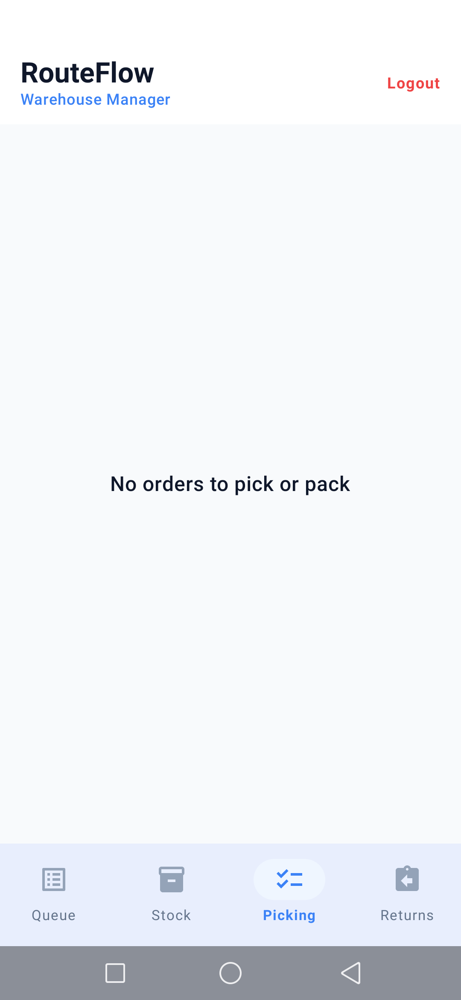 | 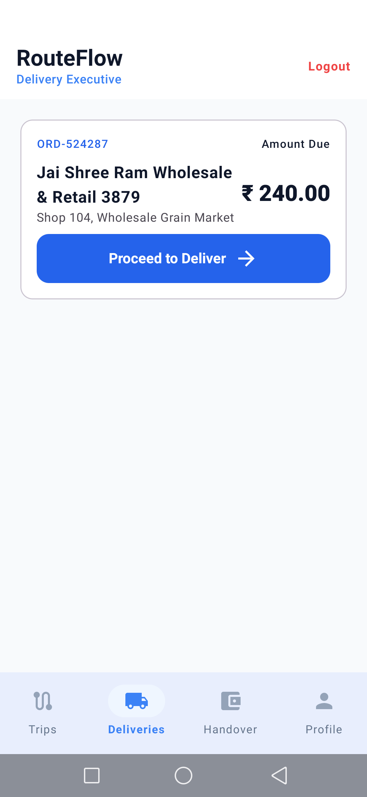 |
| *Godown desk: Approved orders queue, item checklist, packing* | *Driver dispatch list with amount due & shop address* |

| Server OTP Delivery Verification | Driver Cash Handover Reconciliation |
|:---:|:---:|
| 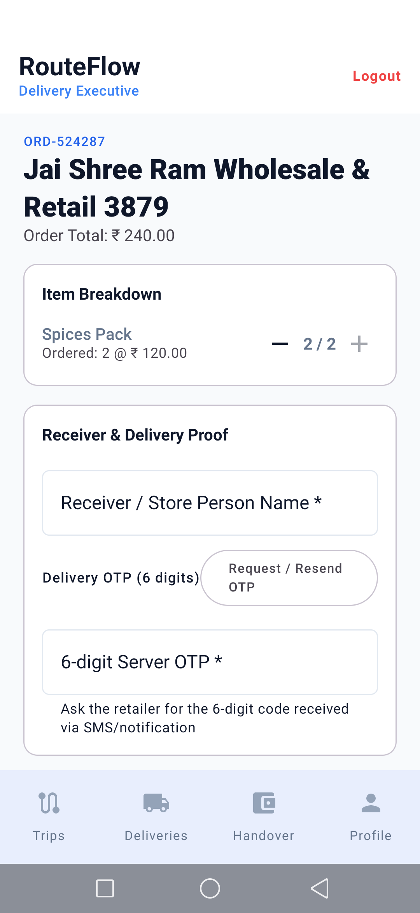 | 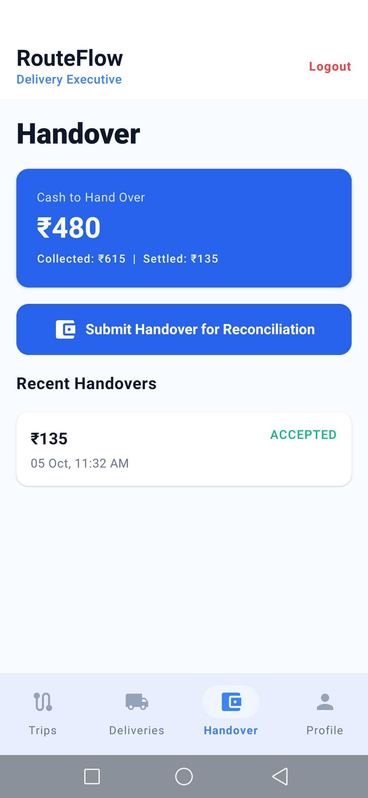 |
| *6-Digit Server OTP verification & store person signature proof* | *Driver physical cash custody ledger & Owner settlement* |

---

## 👥 Role Access & Multi-Platform Matrix

RouteFlow is designed so field workers use the phone, while the owner & admin control everything from web or phone:

| Role | Phone App | Web Dashboard (`/dashboard`) |
|---|---|---|
| **Owner** | View alerts, quick approvals, business status | Full dashboard, reports, employees, stock, payments, settings |
| **Admin / TL** | Monitor team, assign delivery, handle exceptions | Operations dashboard, route/beat monitoring, approvals |
| **Sales Executive** | Add shop, visit, order, collect payment, GPS | Basic web view (My shops & orders) |
| **Warehouse Manager** | Pick, pack, stock entry, return inspection | Godown dashboard, stock reports, GRN/inward |
| **Delivery Executive** | Route navigation, OTP delivery, collect payment, cash handover | Trip & cash history |

---

## 🔄 The Complete Daily 7-Stage Workflow

```
[1. FIELD VISIT] ──> [2. BOOK ORDER] ──> [3. OWNER APPROVAL] ──> [4. WAREHOUSE PICK & PACK]
 Salesperson          Salesperson         Owner Web/App           Warehouse Manager
 Check-in & GPS       Applies Promos      Reserves Stock          Packs Cartons
                                                                          │
                                                                          ▼
[7. CASH HANDOVER] <── [6. PAYMENT] <── [5. OTP DELIVERY] <────── [ASSIGN DRIVER]
 Owner Settles         Driver Collects   Driver Verifies          Admin / Owner
 Driver Balance to ₹0  Cash into Custody 6-Digit Server OTP       Dispatches Order
```

1. **Owner Setup:** Registers company profile, beats, and adds employees.
2. **Sales Visit & GPS Onboarding:** Salesperson visits kirana stores on beat; taps `+ Add Shop` with 1-tap phone GPS coordinate capture.
3. **Order Booking:** Books orders with auto-promotions (*Buy 10 Get 1 Free*).
4. **Owner Approval:** Owner approves order on Web or App; physical stock is atomically reserved.
5. **Godown Fulfillment:** Warehouse manager picks line items and packs into heavy cartons.
6. **Driver Dispatch & OTP Delivery:** Delivery executive delivers order with server-validated 6-digit OTP and store person name.
7. **Cash Reconciliation:** Driver submits collected physical COD cash; Owner verifies and settles driver balance to ₹0.00.

---

## 🛠️ Tech Stack & Architecture

- **Android App:** Kotlin, Jetpack Compose, Material 3, Room Database, Hilt DI, Retrofit/OkHttp, WorkManager.
- **Web Dashboard:** Next.js 16 (App Router), React 19, Tailwind CSS (Deployed on Vercel).
- **Backend API:** Cloudflare Workers running Hono framework.
- **Database:** Cloudflare D1 (Serverless SQLite with atomic ledger constraints).

---

## 🚀 Quick Start Commands

### Backend Tests & Verification
```bash
cd backend
npm test                                                                # 30 unit & integration tests
node --dns-result-order=ipv4first test/test-hardcore-empty-business.mjs # 16-step hardcore test
npx wrangler deploy --config wrangler.staging.toml                      # Deploy API to Cloudflare
```

### Web Dashboard
```bash
cd web
npm install
npm run dev    # Local development at http://localhost:3000
npm run build  # Production build
```

### Android App
```bash
# Run unit tests
.\gradlew.bat testStagingUnitTest --no-daemon

# Build Staging APK
.\gradlew.bat assembleStaging --no-daemon

# Install on physical phone over ADB
adb install -r app\build\outputs\apk\staging\app-staging.apk
```
